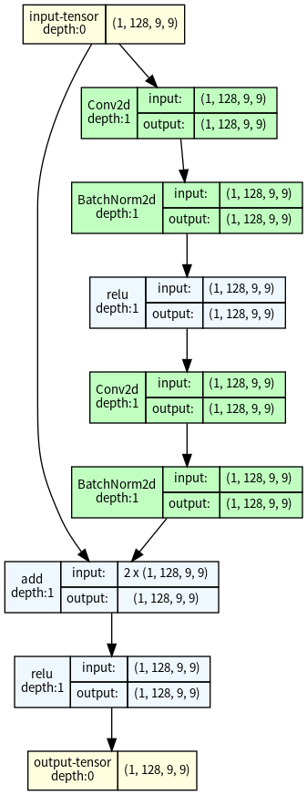
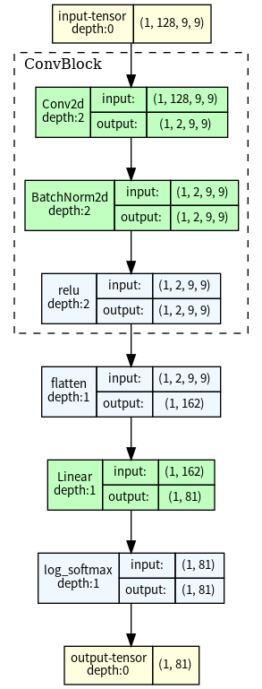
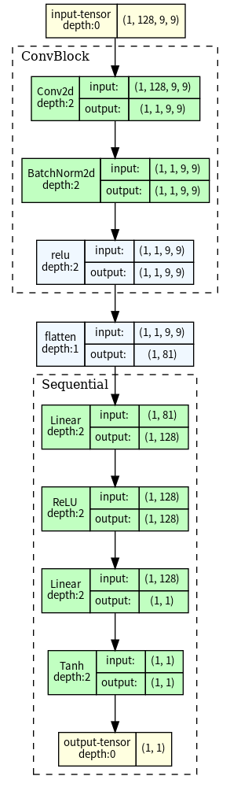

# Gomoku-wuzi

**This project presents a Gomoku (Five-in-a-Row) game featuring two distinct AI approaches:**  
1. **Alpha-Beta Pruning-based AI** that utilizes a recursive Minimax algorithm with Alpha-Beta pruning for efficient move searching.  
2. **Deep Learning-based AI**, incorporating Convolutional Neural Networks (CNNs) and AlphaZero-style Policy-Value Networks for advanced board evaluation and decision-making. 

Built with **Python**, **PyTorch**, and **Pygame**, the project offers both **Player vs Player** and **Player vs AI** modes.

<p align="center">
  
</p>

## Version Management

- **System:** Ubuntu 22.04 LTS

- **GPU Backend:** ROCm 5.7.0  

- **Python Version:** 3.10.12  

- **PyTorch:** 2.2.2+rocm5.7  

## How to Play  

### Normal Mode (gomoku.py)

Run the following command in your terminal:  
```bash
python3 gomoku.py
```  

This Gomoku game offers the following modes:  
1. **Player vs Player** – Two human players take turns placing stones.  
2. **Player vs AI** – Challenge an AI opponent powered by Alpha-Beta Pruning, CNNs, or an AlphaZero-inspired network.  

### 🕹️ Controls  
**Left Click**: Place a stone on an empty board position.  

### 🏆 Game Rules  
- Players take turns placing stones on the board.  
- The first player to get **five stones in a row** (horizontally, vertically, or diagonally) wins.  
- If the board is full without a winner, the game is a draw.

### 🔧 AI Difficulty  
#### Models
1. **go_model.pth** – Trained using an Artificial Neural Network (ai.py).  
2. **go_model_val_net_alphazero.pth** – Trained using Convolutional Neural Networks (val_net_ai.py). 

#### Models performance
- **CNNs-based model (go_model_val_net_alphazero.pth)** performs better than the ANN model due to its ability to capture spatial patterns on the board.  
- However, the AI's primary decision-making is still driven by **Minimax with Alpha-Beta pruning**, not just the trained model.  

#### To adjust difficulty:
- The default AI uses a **hybrid mode** (set in `search.py`), which balances model evaluation with traditional search algorithms. This setting is roughly at an **advanced player level**.  
- **Easier AI**: Modify `search.py` to use **pure model evaluation mode** instead of hybrid. This results in AI performance closer to a beginner.

### Alphazero Modes (alphagomoku/gomoku_game.py)

Run the following command in your terminal:  
```bash
cd alphagomoku
python3 gomoku_game.py
```  

### 🕹️Controls & 🏆Rules
Same as normal mode

### 🔧 AI Difficulty
The more **self-play iterations** a model undergoes, the stronger it becomes:
  - **500 games** → Beginner Level  
  - **1000 games** → Intermediate Level  
  - **2700 games** → Advanced Level   

You can determine the self-play count from the model filename:  
- Example: **`final_policy_value_net_2700.pth`** represents a model trained with **2700 self-play games**.  

All **AlphaZero-trained models** are stored in:  
📂 **`alphagomoku/model/`** 

## Implementation Steps

### 1. Traditional Board Evaluation Method (alpha_beta.py)

**Search Strategy:**
- The program uses a **recursive Minimax algorithm** combined with **Alpha-Beta pruning** to search for the best move.
- **Alpha-Beta pruning** eliminates branches that will not affect the final decision, significantly reducing the number of nodes evaluated.
- The search is depth-limited, with a default maximum depth of 3.

**Evaluation Method:**
1. **Board Traversal:**  
   The evaluation function iterates through every point on the board. If a stone is present, it evaluates four possible directions:
   - Horizontal  
   - Vertical  
   - Diagonal (\)  
   - Anti-diagonal (/)

2. **Line Evaluation:**  
   For each direction, the algorithm forms a line centered on the current stone, extending four points forward and backward, creating a **9-point array**. This array is then analyzed to detect patterns like consecutive stones or open ends.

3. **Scoring Rules:**  
   The scoring system assigns specific values based on common winning patterns:
   - **Five in a row:** ±10000 points (instant win/loss)  
   - **Four in a row (open):** ±9050 points  
   - **Active Threats:**  
     - **Live Three, Dead Three, Live Two, Dead Two** are given incremental scores based on their strength.  
   - The final score is calculated as:  
     **(Black's total score) – (White's total score)**

### 2. ANN Board Evaluation Method (ai.py)

**Model Architecture:**
- The model, named **NuNet**, is a fully connected feedforward neural network.
- **Input Layer:**  
  - 361 neurons representing the 19x19 Go board (flattened into a 1D array).  
  - **Encoding:**  
    - `1` for the current player’s stones.  
    - `2` for the opponent’s stones.  
    - `0` for empty spaces.  
- **Hidden Layers:**  
  - Multiple dense layers with ReLU activations: 32 → 64 → 128 → 64 → 8 neurons.  
- **Output Layer:**  
  - A single neuron with ReLU activation producing a scalar evaluation score.  
  - The score is scaled between **-10,000** (worst) and **10,000** (best).

**Training Details:**
- **Loss Function:** Mean Squared Error (**MSE**)  
- **Optimizer:** Adam with a learning rate of **0.001**  
- **Batch Size:** 64  
- **Epochs:** 200  
- **Device:** 7900xtx

<p align="center">
  
</p>

**Performance on Test Set:**
- **Evaluation Loss:** `0.2061`  
- **Mean Absolute Error (MAE):** `0.3928`  

An MAE of 0.39 on the [0,1] interval indicates insufficient predictive capability of the model. The data essentially converges after around 125 training iterations, and further testing with 500 iterations showed a similar convergence rate. However, the MAE performance remains poor. It is suspected that this is due to insufficient features. The input features consist of a 19x19 board flattened into a 361-dimensional vector. This representation may fail to fully capture the spatial structure and local relationships of the board.

### 3. CNNs AlphaZero value network inspired Board Evaluation (val_net_ai.py)

**Model Architecture:**
- The model, **VaNet**, is a **deep CNN**.
- **Input Format:**  
  - **Shape:** (1, 19, 19), representing the **Go board** as a single-channel image.  
  - **Encoding:**  
    - `1` for the current player’s stones.  
    - `2` for the opponent’s stones.  
    - `0` for empty spaces.  

- **Convolutional Layers:**  
  - 3 convolutional layers with **ReLU activation** and **batch normalization** to extract spatial patterns.  
  - Kernel size: `3×3`, stride: `1`, padding: `1`.  
  - Feature maps: `32 → 64 → 128`.  

- **Fully Connected Layers:**  
  - After flattening, the output is processed through two **dense layers** (`128 → 1`) to predict a score.  

**Training Details:**
- **Loss Function:** Mean Squared Error (**MSE**)  
- **Optimizer:** Adam (**learning rate = 0.001**)  
- **Regularization:** L2 weight decay (`1e-5`)  
- **Learning Rate Scheduler:** Step decay (halving every **50 epochs**)  
- **Batch Size:** 64  
- **Epochs:** 200  
- **Device:** 7900xtx 

<p align="center">
  
</p>

**Performance on Test Set:**
- **Evaluation Loss:** `0.0172`  
- **Mean Absolute Error (MAE):** `0.0371`  

The model achieved an MAE of 0.037 on the test set, which I believe demonstrates excellent performance. Compared to the previous ANN model, this one retains the board's two-dimensional features and converges around 430 training iterations (though I'm not certain, as I only trained up to 500 iterations). Although the MAE continues to decrease after 200 iterations, further training leads to overfitting, causing the MAE to spike from 0.037 to 0.2568. 

During actual gameplay, the model shows the ability to connect its own pieces and partially block the opponent's moves. The only drawback is the large model size, caused by the massive number of parameters in `nn.Linear(128 * 19 * 19, 128)`. A potential way to reduce the model size is by applying pooling.

### AlphaZero policy value network and mcts (alphagomoku)

**Model Architecture:**  

Uses a **Policy-Value Network**, which takes the board state as input and outputs:  
- **1. Input Layer:**  
  - Input size: `(batch_size, 6, board_len, board_len)`  
    - `6` feature planes, including the current game state, valid moves, etc.  
    - `board_len` defaults to `9`, meaning a `9x9` board. (You can also set it to 19×19, but the training cost will be very high unless you have a powerful GPU😔)

- **2. Convolution + Residual Blocks (The first image below)**  
  - **First Convolutional Layer:**  
    - 128 channels, 3×3 convolution, ReLU activation.  
  - **4 Residual Blocks:**  
    - Each block consists of:  
      - 3×3 Convolution → BatchNorm → ReLU → 3×3 Convolution → BatchNorm → Residual Connection 

- **3. Policy Head (The second image below)**  
  - 1×1 convolution layer, reducing dimensions to 2 channels.  
  - Fully connected layer, outputting an action probability vector of size `board_len^2` (using `log_softmax` for normalization).  

- **4. Value Head (The last image below)**  
  - 1×1 convolution layer, reducing dimensions to 1 channel.  
  - Fully connected layer mapping `board_len × board_len` to 128 dimensions.  
  - Followed by ReLU + Linear layer + `tanh`, producing an output range of `[-1, 1]`.  

<p align="center">
  
  
  
</p>

The full architecture diagram can be found at: `img/policy_value_net_full.png`

**Training Process**  

- **1. Self-Play**  
   - Uses **Monte Carlo Tree Search (MCTS)** to generate games and collect training data `{state, π, z}`:  
     - `state`: Current board state.  
     - `π`: Action probability distribution generated by MCTS.  
     - `z`: Final game result (`+1` win / `-1` loss / `0` draw).  

- **2. Data Storage**  
   - Training data is stored in `SelfPlayDataSet`. Once the dataset reaches `start_train_size`, training begins.  

- **3. Model Training**  
   - **Loss Function:**  
     - **Value Loss (MSE Loss):** `(value - z)^2`  
     - **Policy Loss (Cross-Entropy Loss):** `-Σ(π * log(p_hat))`  
   - Trains for `5` mini-batch iterations using the **Adam** optimizer (`lr=0.01`).  

- **4. Testing & Model Updates**  
   - Every `check_frequency` iterations, the model is tested against the **historical best model** over `n_test_games`.  
   - **If the win rate exceeds 55%, the new model replaces the best model.**  

Using the settings in `start_train.py`, 1000 self-play games take approximately 3 hours.  

## Reference

This project references the minmax algorithm from [gobang](https://github.com/skywind3000/gobang) 

DeepMind AlphaZero: [Mastering the game of Go without human knowledge](https://www.nature.com/articles/nature24270.epdf?author_access_token=VJXbVjaSHxFoctQQ4p2k4tRgN0jAjWel9jnR3ZoTv0PVW4gB86EEpGqTRDtpIz-2rmo8-KG06gqVobU5NSCFeHILHcVFUeMsbvwS-lxjqQGg98faovwjxeTUgZAUMnRQ)

This project uses the AlphaZero architecture, based on [Alpha-Gobang-Zero](https://github.com/zhiyiYo/Alpha-Gobang-Zero)
