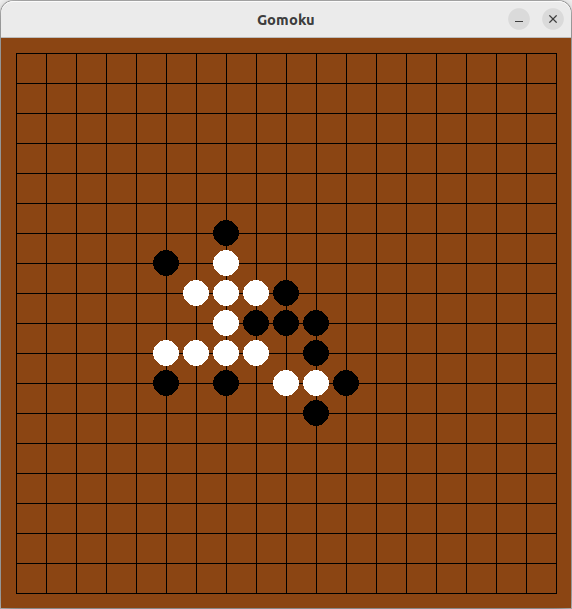
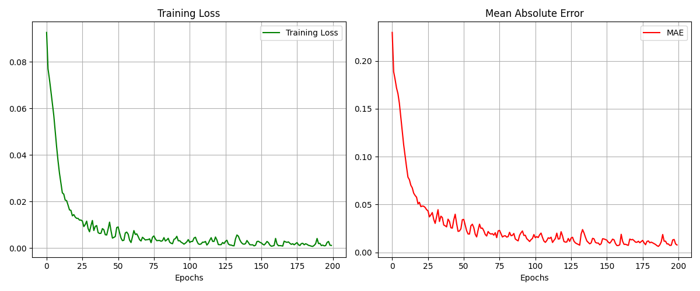
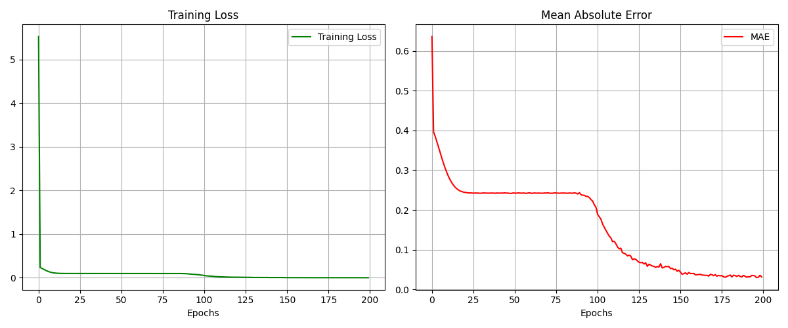

# Gomoku-wuzi

This project presents a **Gomoku** (Five-in-a-Row) game featuring two distinct AI strategies:  
1. **Alpha-Beta Pruning-based AI** for strategic move searching.  
2. **Convolutional Neural Network (CNN)-based AI** for board evaluation and decision-making.

Built with **Python**, **PyTorch**, and **Pygame**, the project offers both **Player vs Player** and **Player vs AI** modes.

  

## Version Management

- **System:** Ubuntu 22.04 LTS

- **GPU Backend:** ROCm 5.7.0  

- **Python Version:** 3.10.12  

- **PyTorch:** 2.2.2+rocm5.7  

## Implementation Steps

### 1. Traditional Board Evaluation Method

**Search Strategy:**
- The program uses a **recursive Minimax algorithm** combined with **Alpha-Beta pruning** to search for the best move.
- **Alpha-Beta pruning** eliminates branches that will not affect the final decision, significantly reducing the number of nodes evaluated.
- The search is depth-limited, with a default maximum depth of 3.

**Evaluation Method:**
1. **Board Traversal:**  
   The evaluation function iterates through every point on the board. If a stone is present, it evaluates four possible directions:
   - Horizontal  
   - Vertical  
   - Diagonal (\)  
   - Anti-diagonal (/)

2. **Line Evaluation:**  
   For each direction, the algorithm forms a line centered on the current stone, extending four points forward and backward, creating a **9-point array**. This array is then analyzed to detect patterns like consecutive stones or open ends.

3. **Scoring Rules:**  
   The scoring system assigns specific values based on common winning patterns:
   - **Five in a row:** ±10000 points (instant win/loss)  
   - **Four in a row (open):** ±9050 points  
   - **Active Threats:**  
     - **Live Three, Dead Three, Live Two, Dead Two** are given incremental scores based on their strength.  
   - The final score is calculated as:  
     **(Black's total score) – (White's total score)**

### 2. ANN Board Evaluation Method

**Model Architecture:**
- The model, named **NuNet**, is a fully connected feedforward neural network.
- **Input Layer:**  
  - 361 neurons representing the 19x19 Go board (flattened into a 1D array).  
  - **Encoding:**  
    - `1` for the current player’s stones.  
    - `2` for the opponent’s stones.  
    - `0` for empty spaces.  
- **Hidden Layers:**  
  - Multiple dense layers with ReLU activations: 32 → 64 → 128 → 64 → 8 neurons.  
- **Output Layer:**  
  - A single neuron with ReLU activation producing a scalar evaluation score.  
  - The score is scaled between **-10,000** (worst) and **10,000** (best).

**Training Details:**
- **Loss Function:** Mean Squared Error (**MSE**)  
- **Optimizer:** Adam with a learning rate of **0.001**  
- **Batch Size:** 64  
- **Epochs:** 200  
- **Device:** 7900xtx

  

**Performance on Test Set:**
- **Evaluation Loss:** `0.2061`  
- **Mean Absolute Error (MAE):** `0.3928`  

An MAE of 0.39 on the [0,1] interval indicates insufficient predictive capability of the model. The data essentially converges after around 125 training iterations, and further testing with 500 iterations showed a similar convergence rate. However, the MAE performance remains poor. It is suspected that this is due to insufficient features. The input features consist of a 19x19 board flattened into a 361-dimensional vector. This representation may fail to fully capture the spatial structure and local relationships of the board.

### 3. CNNs AlphaZero value network inspired Board Evaluation

**Model Architecture:**
- The model, **VaNet**, is a **deep CNN**.
- **Input Format:**  
  - **Shape:** (1, 19, 19), representing the **Go board** as a single-channel image.  
  - **Encoding:**  
    - `1` for the current player’s stones.  
    - `2` for the opponent’s stones.  
    - `0` for empty spaces.  

- **Convolutional Layers:**  
  - 3 convolutional layers with **ReLU activation** and **batch normalization** to extract spatial patterns.  
  - Kernel size: `3×3`, stride: `1`, padding: `1`.  
  - Feature maps: `32 → 64 → 128`.  

- **Fully Connected Layers:**  
  - After flattening, the output is processed through two **dense layers** (`128 → 1`) to predict a score.  

**Training Details:**
- **Loss Function:** Mean Squared Error (**MSE**)  
- **Optimizer:** Adam (**learning rate = 0.001**)  
- **Regularization:** L2 weight decay (`1e-5`)  
- **Learning Rate Scheduler:** Step decay (halving every **50 epochs**)  
- **Batch Size:** 64  
- **Epochs:** 200  
- **Device:** 7900xtx 

  

**Performance on Test Set:**
- **Evaluation Loss:** `0.0172`  
- **Mean Absolute Error (MAE):** `0.0371`  

The model achieved an MAE of 0.037 on the test set, which I believe demonstrates excellent performance. Compared to the previous ANN model, this one retains the board's two-dimensional features and converges around 430 training iterations (though I'm not certain, as I only trained up to 500 iterations). Although the MAE continues to decrease after 200 iterations, further training leads to overfitting, causing the MAE to spike from 0.037 to 0.2568. 

During actual gameplay, the model shows the ability to connect its own pieces and partially block the opponent's moves. The only drawback is the large model size, caused by the massive number of parameters in `nn.Linear(128 * 19 * 19, 128)`. A potential way to reduce the model size is by applying pooling.

## Reference

This project references the minmax algorithm from [gobang](https://github.com/skywind3000/gobang) 

DeepMind AlphaZero: [Mastering the game of Go without human knowledge](https://www.nature.com/articles/nature24270.epdf?author_access_token=VJXbVjaSHxFoctQQ4p2k4tRgN0jAjWel9jnR3ZoTv0PVW4gB86EEpGqTRDtpIz-2rmo8-KG06gqVobU5NSCFeHILHcVFUeMsbvwS-lxjqQGg98faovwjxeTUgZAUMnRQ)

This project uses the AlphaZero architecture, based on [Alpha-Gobang-Zero](https://github.com/zhiyiYo/Alpha-Gobang-Zero)
